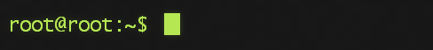

#shag_to_ctf
Мини-платформа для проведения турнира по кибербезопасности для детей 11-14 лет.

## Перед началом

### Установка

Шаг 1. Качаем репозиторий

Шаг 2. Открываем в браузере файл `index.html`

## Что делать
Логика простая: дети проходят задания, а взрослый находится рядом в случае чего помогает. 
Задания подобраны таким образом, чтобы со знакомством с группой хватило на час.

## Как платформа работает
### Состав
Платформа состоит из трёх частей, которые идут последовательно друг за другом:

`Сраница с правилами (index) -> Страница с заданиями (task_page) -> Страница с концом (done_competition)`

На странице с заданиями есть несколько, которые ведут на другие сайты или что-то закачивают пользователю на компьютер из папки `resources`.
### Нюансы
Платформа спроектирована таким образом, чтобы можно было быстро сбросить прогресс текущего игрока и посадить за компьютер нового. 
Для этого достаточно перезагрузить `task_page`. На всякий случай детям об этом будет выдано предупреждение.

JavaScript код специально [обфусцирован](https://www.obfuscator.io/), чтобы дети не могли посмотреть код, ибо вся валидация 
заданий происходит на стороне клиента. Если нужно получить доступ к js коду, достаточно открыть тег `v1.0`. 

### Прочее
Отдельное спасибо автору [другой платформы](https://github.com/IPvFletch/KiddoCTF), которая вдохновила меня своим дизайном.